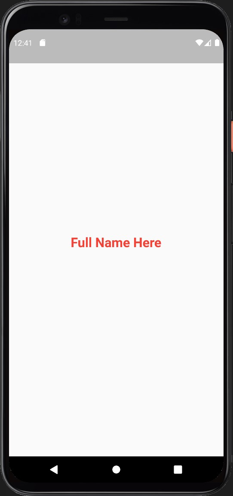
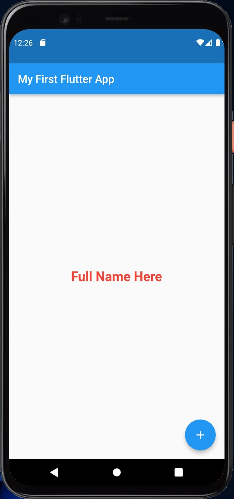

# UC-Flutter-cw-2

## تمرين 1

- قم بإنشاء برنامج جديد و احفظه باسم flutter_first_project
- احذف الكود المكتوب
- اضف كودك الخاص لتصنع صفحة فيها اسمك الثلاثي يظهر الاسم بمنتصف الصفحة مع اضافة بعض التنسيقات على الخط مثال

---

## بونص

- احفظ اسمك في متغير وقم باستخام المتغير لكتابة اسمك في الصفحة
- اجعل صفحتك كالمثال عن طريق اسخدام خصائص الscaffold
- اطبع اسمك باستخام المتغير عندما تضغط على الزر
- اجعل اسمك يطبع بالcapital letter

